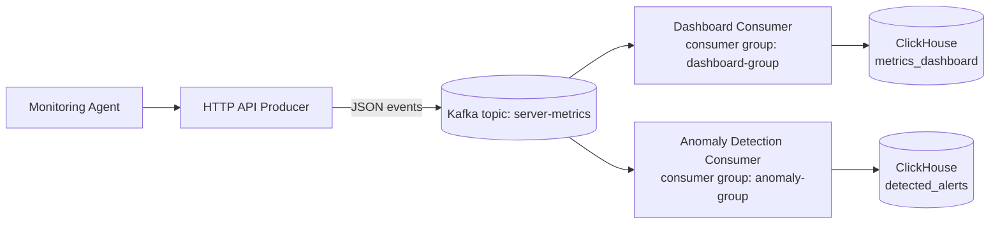

# Kafka Monitoring Demo

This project shows how Apache Kafka keeps events available for later consumers.
The dashboard service starts first and writes all metrics to ClickHouse. The anomaly service is deployed later, subscribes with a brand-new consumer group, and replays old messages from the beginning of the topic.

## Prerequisites

- Go 1.25 or newer
- Docker and Docker Compose

## Architecture



## Kafka concepts in the demo

**Topic**: `server-metrics`

**Partitions**: Kafka splits a topic into partitions. This demo creates the topic with 3 partitions and keys messages by `server_id`, so each server's event stream stays ordered within a partition.

**Offsets**: Every message in a partition gets an offset. Consumers log both partition and offset so you can see exactly which records were read.

**Consumer groups**: The dashboard consumer uses `dashboard-group`. The anomaly consumer uses `anomaly-group`. Each group gets its own copy of the stream, which is why the anomaly service can start later and still read historical data.

**Retention**: Kafka keeps events until the retention policy deletes them. In this local setup the broker keeps logs for 7 days, which is long enough to demonstrate replay.

**Replay**: The anomaly consumer uses `auto.offset.reset=earliest`. If the group has no committed offset, Kafka starts it from the earliest retained message, so it processes historical metrics before continuing with live ones.

## ClickHouse tables

`metrics_dashboard`

```sql
CREATE TABLE metrics_dashboard (
    server_id String,
    cpu_usage Float64,
    memory_usage Float64,
    timestamp DateTime
)
ENGINE = MergeTree
ORDER BY (server_id, timestamp);
```

`detected_alerts`

```sql
CREATE TABLE detected_alerts (
    server_id String,
    alert_type String,
    metric_value Float64,
    event_timestamp DateTime,
    detected_at DateTime
)
ENGINE = MergeTree
ORDER BY (server_id, detected_at);
```

## Run locally

1. Start infrastructure:

```bash
docker compose up -d
```

2. Start the HTTP producer:

```bash
go run ./cmd/api
```

3. Start the dashboard consumer:

```bash
go run ./cmd/dashboard-consumer
```

4. Send sample metrics:

```bash
curl -X POST http://localhost:8080/metrics \
  -H "Content-Type: application/json" \
  -d '{
    "server_id":"web-01",
    "cpu_usage":95.4,
    "memory_usage":82.1,
    "timestamp":"2026-06-08T18:30:00Z"
  }'
```

5. Generate a steady stream of random metrics:

```bash
./scripts/send_random_metrics.sh
```

6. Start the anomaly consumer later:

```bash
go run ./cmd/anomaly-consumer
```

## Presentation flow

1. Start Kafka and ClickHouse.
2. Start the producer API.
3. Start the dashboard consumer.
4. Send metrics for a few minutes.
5. Verify rows in `metrics_dashboard`.
6. Keep the anomaly consumer stopped.
7. Generate metrics with CPU or memory above 90.
8. Start the anomaly consumer after data already exists.
9. Show that it begins from the earliest retained offset and detects historical anomalies.
10. Verify new alerts in `detected_alerts`.
11. Keep sending metrics and show replayed and live events being processed.

## Useful queries

```sql
SELECT * FROM metrics_dashboard ORDER BY timestamp DESC LIMIT 20;
SELECT * FROM detected_alerts ORDER BY detected_at DESC LIMIT 20;
```
